# 🚀 SEND_MESSAGE_DISCORD

## SAP BTP CPI - SEND_MESSAGE_DISCORD

🎯 🧩 Objetivo do iFlow

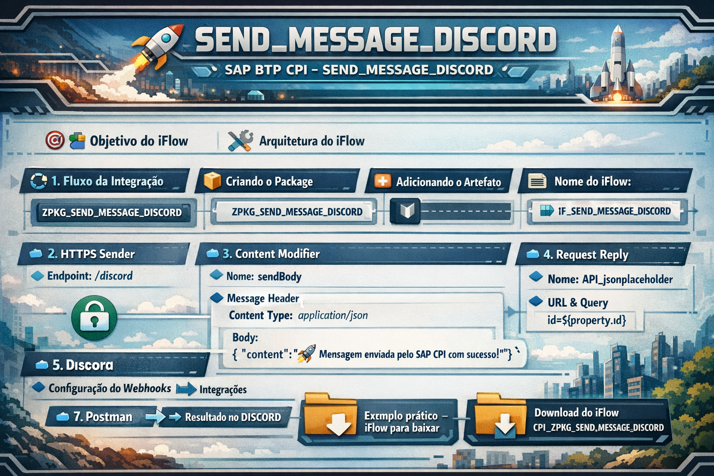

---

<br>

# 🏗️ 🔧 Arquitetura do iFlow

<br><br>

# 🔄 1. Fluxo da Integração

<br>

### 🧱 Criando o Package


<br><br>

### 🏷️ Nome do Package
```
ZPKG_SEND_MESSAGE_DISCORD
```
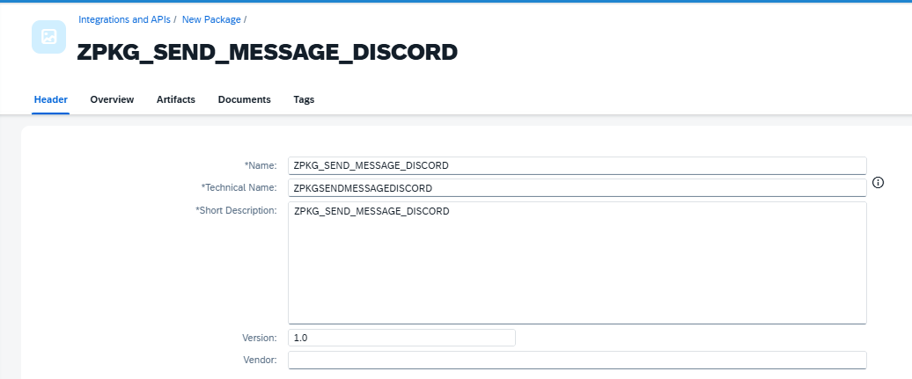

<br>

### ➕ Adicionando o Artefato
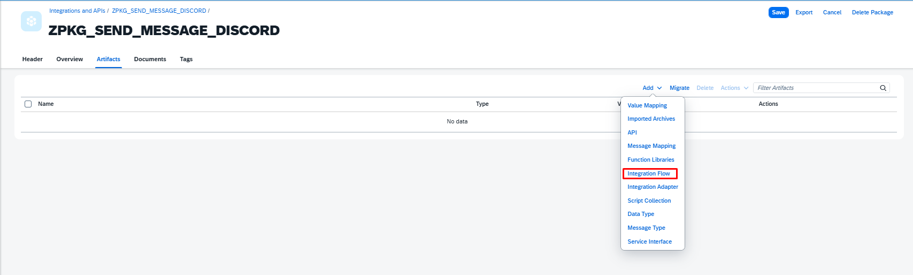

<br>

### 🏷️ Nome do iFlow
```
IF_SEND_MESSAGE_DISCORD
```
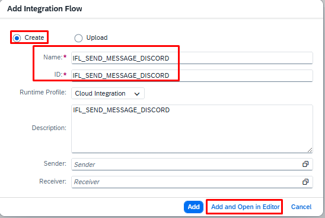

<br>

### ➕ Adicionando o Adapter
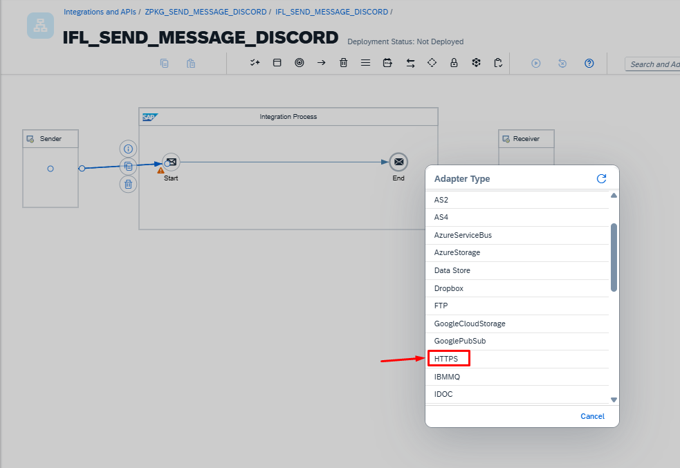


# 🔹 3. HTTPS Sender (Trigger)
```
Endpoint: /discord
```
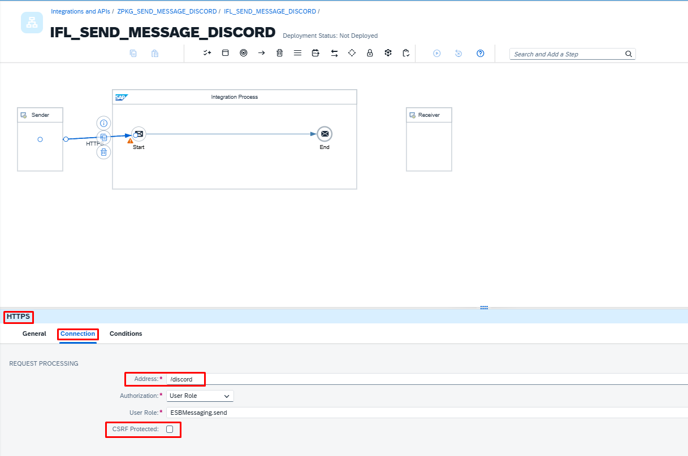

# 🔹 4. Content Modifier

### ➕ Adicionando o Content Modifier
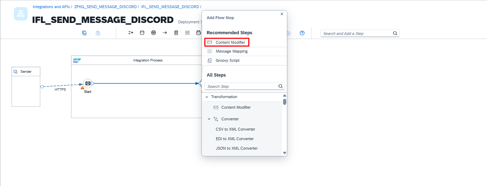

<br>

### 🏷️ Renomeando o Content Modifier
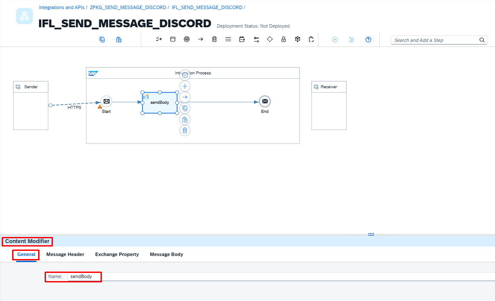
```
Nome: sendBody
```

<br>

### ⚙️ Configuração do Content Modifier
Message Header
```
| Campo        | Valor            |
| ------------ | ---------------- |
| Name          | Source Value    |
| Content Type  | application/json|

```
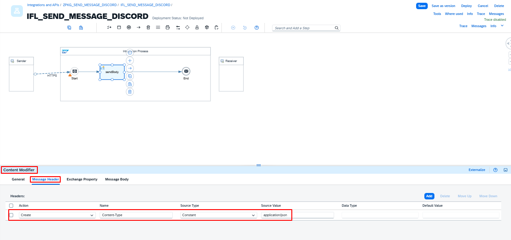

<br>
### ⚙️ Configuração do Content Modifier
Body
```
{
  "content": "\uD83D\uDE80 Mensagem enviada pelo SAP CPI com sucesso!"
}
```
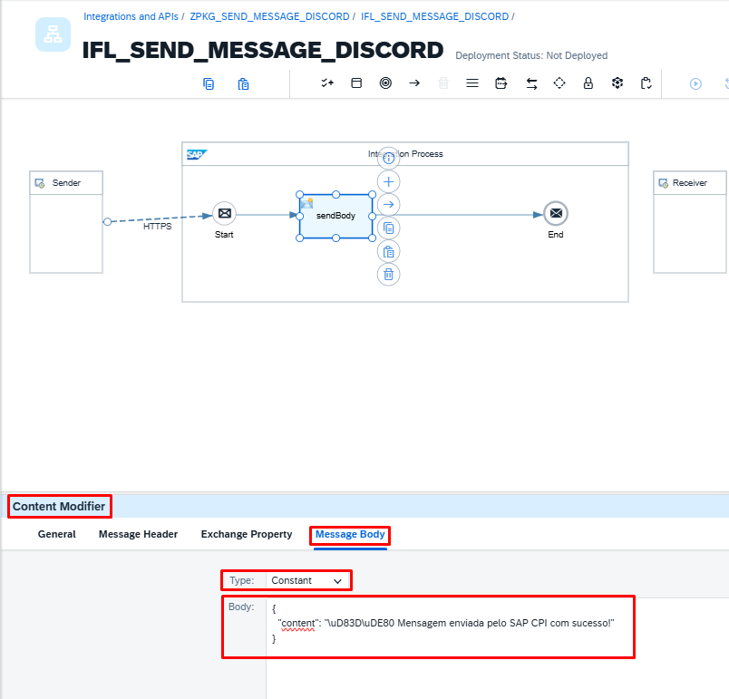


# 🔹 5. Request Reply (Chamada API)

### ➕ Adicionando Request Reply


<br>

### 🏷️ Renomeando o Request Reply
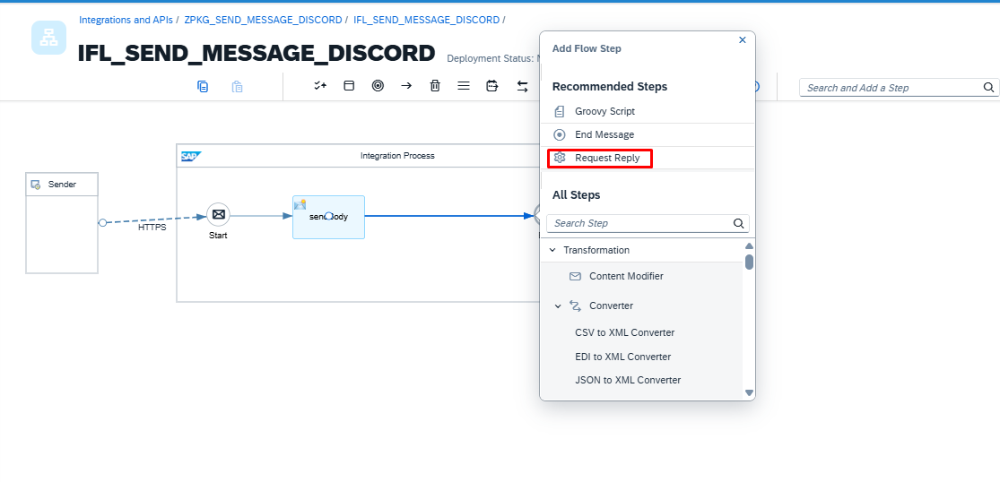
```
Nome: API_jsonplaceholder
```

<br>

### ➕ Adicionando o Adapter
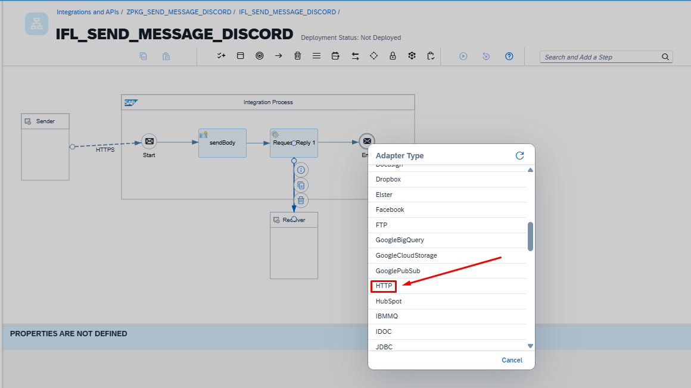

<br>

### ⚙️ Configuração do Request Reply
```
URL: https://jsonplaceholder.typicode.com/posts
Query: id=${property.id}
```
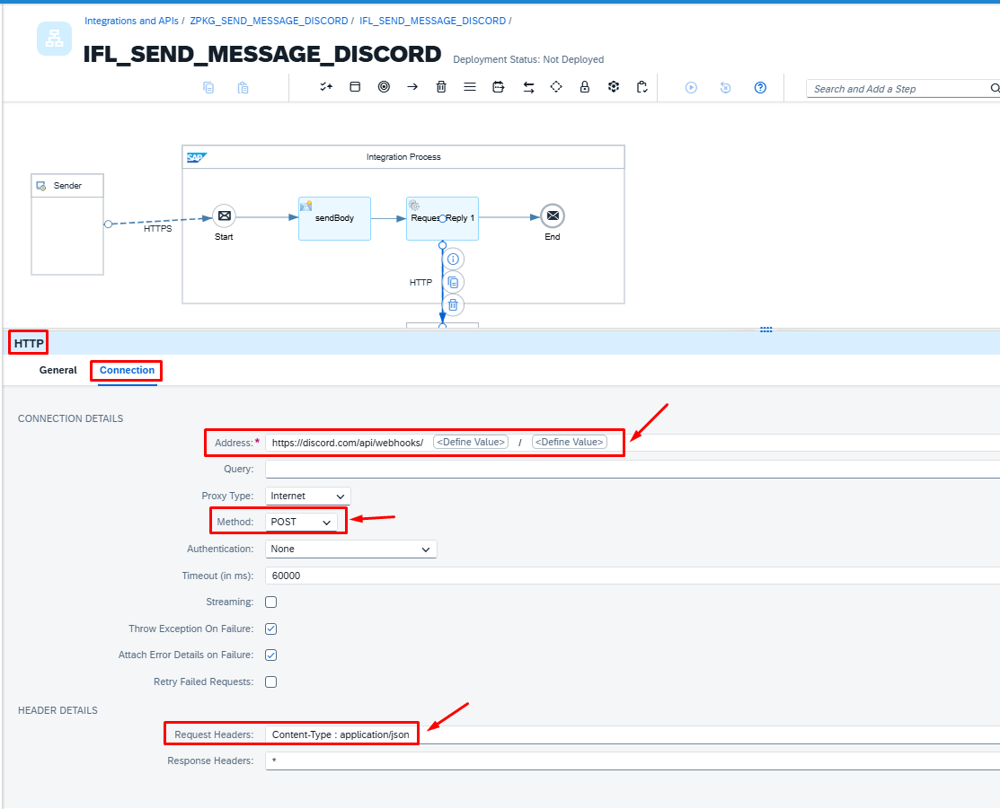

<br>

# 🔹 6. Content Modifier (Get Payload)

### ➕ Adicionando o Content Modifier


<br>

### 🏷️ Renomeando o Content Modifier
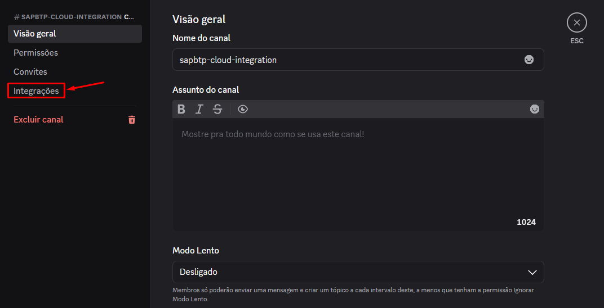
```
Nome: cm_get_payload
```

<br>

### ⚙️ Configuração do Content Modifier 

Message Body
```
Type: Expression
Body: ${body}
```
# 🔹 7. Content Modifier (Prepare Payload)

### ➕ Adicionando o Content Modifier
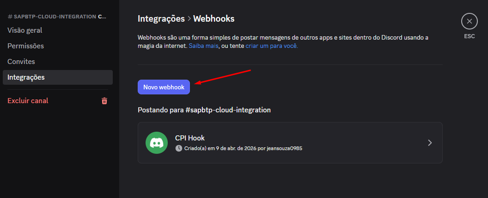

<br>

### ⚙️ Configuração do Content Modifier

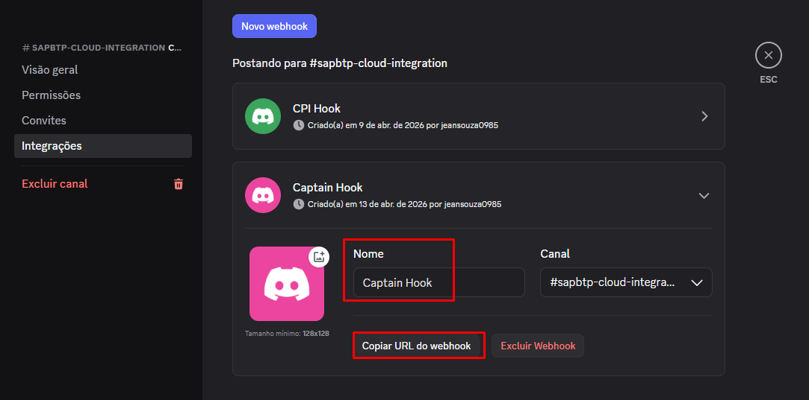

<br>

# 🔹 8. Groovy Script (ENCODER Base64)

### ➕ Adicionando o Adapter Groovy Script
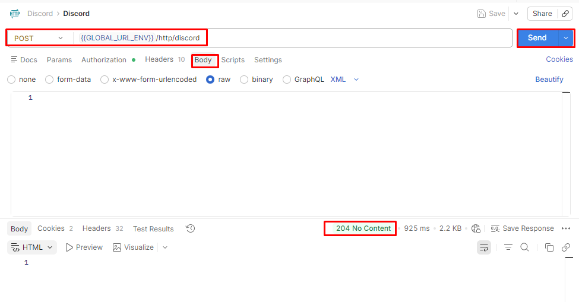

<br>

### 🏷️ Renomeando o Groovy Script
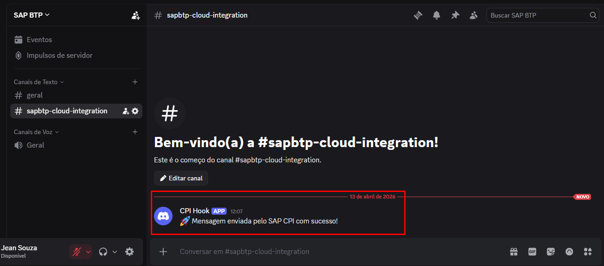
```
Nome: groovy_encode
```


<br>
<br>

---

## 📦 Exemplo prático – iFlow para baixar

📦 [Download do iFlow – CPI_ZPKG_SEND_MESSAGE_DISCORD](https://github.com/souzajean/ZPKG_SEND_MESSAGE_DISCORD/raw/main/Package/IFL_SEND_MESSAGE_DISCORD.zip)
